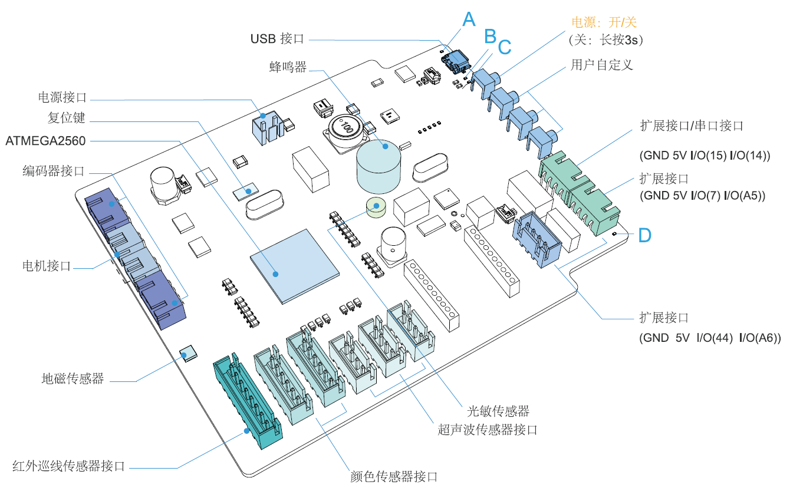
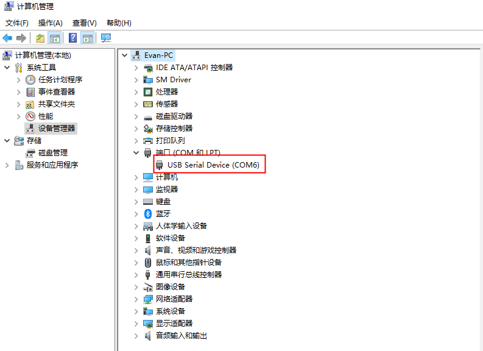

# 控制器与传感器特性

## 3. 特性说明

### 3.1 AI-Starter 控制器

#### 3.1.1 概述

  AI-Starter控制板是以AT Mega2560为核心，兼容Arduino的开发板，不仅集成了电机驱
动、地磁感应器、光敏、按键、LED等模块，还集成了红外巡线信号接口、超声波模块信号
接口、USB、Xbee、蓝牙、串口等接口。AI-Starter主控板预置了两个舵机信号接口，方便
用户扩展。AI-Starter主控板如图 3.1所示。

                                                         串口 2

*图 3.1   AI-Starter 控制板示意图*

#### 3.1.2 AT Mega2560 处理器

  AI-Starter处理器为atmega2560，兼容arduino2560，可以直接通过arduinoIDE进行开发，
同时我们还提供了Mixly的图形化编程环境。

#### 3.1.3 按键

AI-Starter 控制器尾部集成了四位独立按键，如图 3.1 所示，详细说明如表 3.1 所示。

表 3.1 按键说明

| 序号 | 说明 |
| :---: | :--- |
| **1** | 开关按键，开启或停止 AI-Starter。当停止 AI-Starter 时，需长按此按键约 3 秒。 |
| **2** | 用户自定义，用户可在 Mixly 或 Arduino IDE 环境中设置其功能。 |
| **3** | 用户自定义，用户可在 Mixly 或 Arduino IDE 环境中设置其功能。 |
| **4** | 用户自定，用户可在 Mixly 或 Arduino IDE 环境中设置其功能。 |
### 3.1.4 LED

AI-Starter 控制器尾部集成了四个 LED 灯，如图 3.1 所示，详细说明如表 3.2 所示。

表 3.2 LED 指示灯说明

| 序号 | 颜色 | 说明 |
| :---: | :---: | :--- |
| **A** | 蓝色 | 用户自定义，用户可在 Mixly 或 Arduino IDE 环境中设置其功能。 |
| **B** | 红色 | <ul><li>**灭**：表示 AI-Starter 处于未充电状态</li><li>**红色常亮**：表示 AI-Starter 处于充电状态</li></ul> |
| **C** | 红色 | <ul><li>**灭**：表示 AI-Starter 电池电压正常</li><li>**红色常亮**：表示 AI-Starter 电池电压低</li></ul> |
| **D** | 蓝色 | 用户自定义，用户可在 Mixly 或 Arduino IDE 环境中设置其功能。 |
### 3.1.5 USB

    AI-Starter控制板集成了USB下载功能，可通过USB连接电脑下载程序至AI-Starter，使
AI-Starter根据程序指令运行。同时USB接口还具备供电功能，当AI-Starter电池电压低时通过
USB连接电脑即可充电。
     USB驱动可支持的操作系统：
- Win7
- Win8
- Win10

> [!IMPORTANT]
> 注意
> 一般情况下，安装了Mixly或Arduino IDE后，系统会自动安装Arduino USB驱动。
> 将AI-Starter通过USB线连接计算机并开机后，可在设备管理器找到相应的COM口，
> 如图 3.2所示。如果未找到相应的COM口，需在“Arduino-X/drivers”目录下重新
> 安装Arduino USB驱动,其中X为Arduino版本号，请根据实际情况选择。

*图 3.2   USB 驱动*

#### 3.1.6 接口说明

图 3.3 AI-Starter 主控板接口示意图

表 3.3 接口说明

| 序号 | 说明 |
| :---: | :--- |
| **1** | 编码器接口，与 AI-Starter 底盘上的右侧电机相连 |
| **2** | 电机接口，与 AI-Starter 底盘上的右侧电机相连 |
| **3** | 电机接口，与 AI-Starter 底盘上的左侧电机相连 |
| **4** | 编码器接口，与 AI-Starter 底盘上的左侧电机相连 |
| **5** | 红外巡线传感器接口，与 AI-Starter 的红外巡线传感器相连 |
| **6** | 颜色传感器接口，与 AI-Starter 底盘上右侧的颜色传感器相连 |
| **7** | 左侧颜色传感器接口，与 AI-Starter 底盘上左侧的颜色传感器相连 |
| **8** | 超声波传感器接口，与 AI-Starter 右侧的超声波传感器相连 |
| **9** | 超声波传感器接口，与 AI-Starter 前方的超声波传感器相连 |
| **10** | 超声波传感器接口，与 AI-Starter 左侧的超声波传感器相连 |
| **11** | Xbee 接口，采用 UART 接口 |
| **12** | 预留舵机接口 |
| **13** | 蓝牙接口，采用 UART 接口 |
| **14** | 预留舵机接口 |
| **15** | 预留串口接口，采用 UART 接口 |
| **16** | Wifi 接口，采用 UART 接口 |
| **17** | USB 接口，采用标准的 Micro-USB 接口 |
| **18** | 电源接口，与 AI-Starter 底盘上的电池相连 |
### 3.2 红外巡线传感器

  AI-Starter小车底部内置一个红外巡线传感器，通过判断地面颜色来识别固定轨迹黑线，
以实现自动巡线行驶。红外巡线传感器内置6路高精度红外对管，配合6个可调电位器，用来
调节红外对管检测的距离的远近，可精确检测到黑线，检测距离为3cm，精度可达0.1cm。

### 3.3 超声波传感器

  AI-Starter小车头部内置三个超声波传感器，可通过超声波反射测量前方3mm~500mm范
围内障碍物的距离。

### 3.4 颜色传感器

    AI-Starter小车底部内置两个颜色传感器，可通过颜色滤波器识别场地中的颜色，使
AI-Starter小车根据不同的颜色执行不同的任务。
