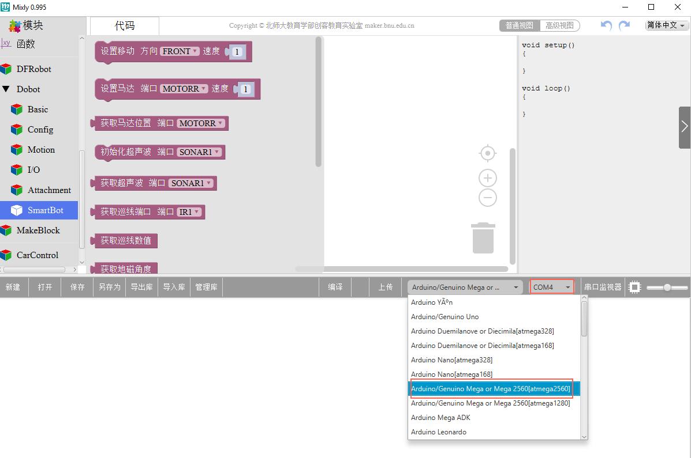
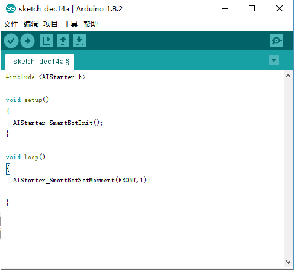

# 安装与使用指南

## 4. 安装指南

### 4.1 Mixly 软件安装

  Mixly是一款基于Google的Blockly图形化编程框架开发的免费开源的Arduino图形化编
程软件，AI-Starter在Mixly增加了API接口，用户可通过积木搭建的方式调用API接口编程并
上传至AI-Starter，以实现对AI-Starter的控制。
      Mixly 软 件 无 需 复 杂 安 装 ， 下 载 安 装 包 解 压 后 即 可 直 接 使 用 。 其 下 载 路 径 ：
http://mixly.org/explore/software/mixly-arduino。

> [!NOTE]
> 目前AI-Starter仅支持Mixly0.995版本，其他版本暂不支持。

### 4.2 Arduino IDE

  AI-Starter同时支持Arduino C语言编程，Arduino是一款便捷灵活、方便升级的开源电子
平台，包括Arduino开发工具Arduino IDE和核心库。用户可通过Arduino IDE调用API 接口进
行编程，并将程序上传到AI-Starter实现对AI-Starter的控制。
  Arduino IDE软件包嵌套在Mixly软件包，解压Mixly安装包后即可直接使用。Arduino IDE
软件路径为“安装路径/Dobot_Mixly/arduino-XXX。其中，XXX为Arduino配套的版本号，请
根据实际情况替换。

## 5. 使用指南

### 5.1 Mixly 使用说明

    Mixly软件界面如图 5.1所示，使用Mixly时需选择Arduino\Genuino Mega or Mega
2560[atmega2560]开发板并选择对应的串口，如图 5.1红框所示。
  用户可在Mixly界面左侧拖动所需的模块，待编译无误后上传至AI-Starter，使AI-Starter
按照编写的程序指令运行。

*图 5.1   Mixly 软件界面*

> [!IMPORTANT]
> 注意
> 如果打开Mixly软件无法获取到AI-Starter对应的串口信息，请确保已安装Arduino
> USB驱动。如果安装后仍无法获取串口信息，请采用管理员身份打开Mixly。
> Mixly使用说明在本手册中不做详细说明，请参见Mixly官网查阅相关手册。

### 5.2 Arduino IDE 使用说明

      Arduino IDE界面如图 5.2所示。

*图 5.2   Arduino IDE 界面*

    打开Arduino IDE软件后，需在“Tools > Borad”选择“Arduino/Genuino Mega or Mega
2560”，
     “Tools > Processor”选择“ATmega2560（Mega 2560）”
                                                ，在“Tools > Port”选择相应
的串口。

用户可在“File > Examples > AiStarter”选择样例，单击  将样例上传至 AI-Starter，使
AI-Starter按样例运行。也可参考章节7调用API编写程序后上传至AI-Starter，使AI-Starter按
自己编写的程序指令运行。
